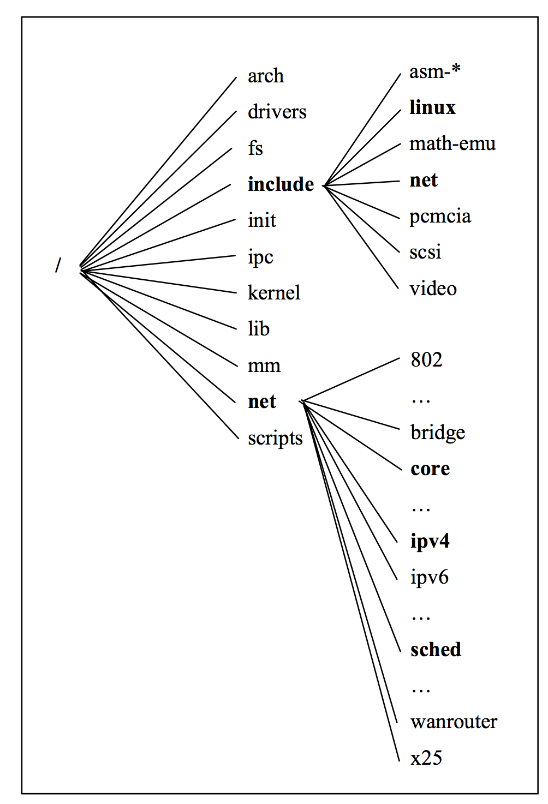
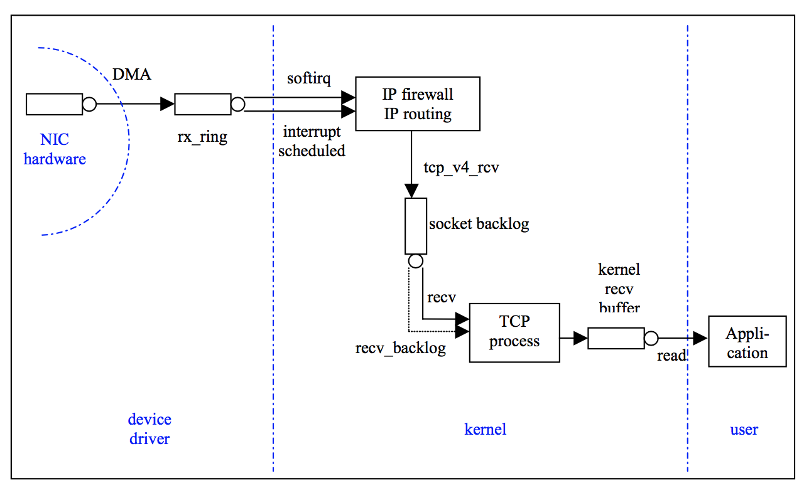
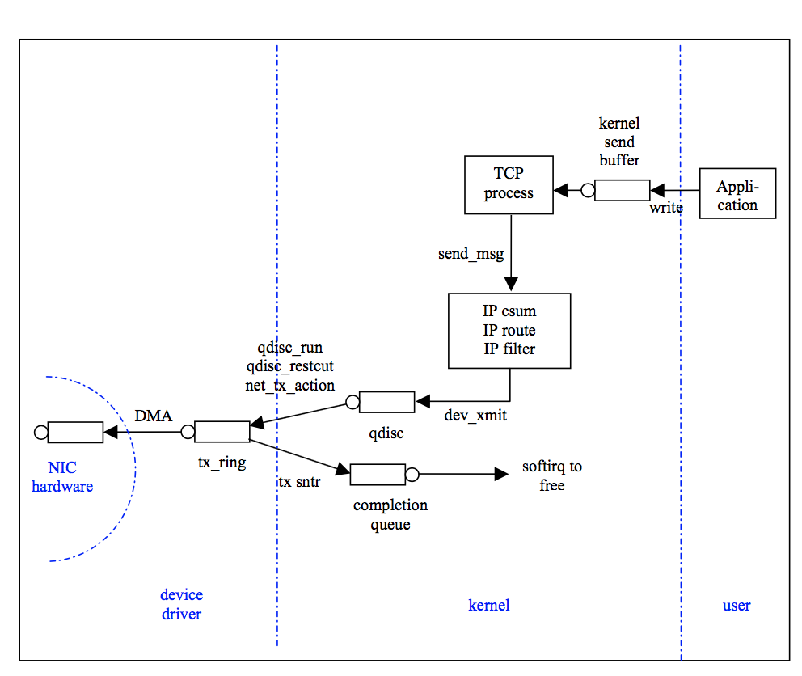

# A map of the Networking Code in Linux Kernel 2.4.20

## 由浅入深Linux Kernel 2.4.20网络

### 内容

#### 引言

当我们开始在 DataTAG testbed 研究gigabit 网络以及终端主机的性能时，我们很快意识到有很多丢包发生在终端主机上，并且不清楚这种丢包发生在哪里。为了更好的理解丢包以及缓冲区溢出，我们绘制了有关Linux内核中网络相关代码的流程图，方便了解网络是如何在linux中实现的，并且可以方便我们检查哪一部分代码是导致丢包的始作俑者，而我们从未注意到。

这份报告阐述了我们对于网络模块在Linux Kernel 2.4.20 下是如何运行的理解。我们选择2.4.20发行版是因为在我们开始书写这份报告的时候，2.4.20是最新最稳定的内核版本(2.6还未正式发布)，并且因为这是第一份支持新应用编程接口(NAPI, New Application Programming Interface)。该API支持了网络中断缓及由此介绍数据包在内核中被处理的一种主要的改变。NAPI是开发版分支2.5的主要新尝试并且应该在2.6版本中出现，直到2.4.20被正式发行。关于NAPI的更多介绍以及相关网络新功能可以查看Cooperstein的在线入门教程。

在这份文档中，我们将通过跟踪主机收发数据包的形式来一览内核。我们不会考虑其他类似于X.25的协议。在相对低层，比如在sub-IP层，我们只关心以太网协议而忽略其他比如ATM(异步传输模式)。最终，在IP相关的代码中，我们在此只描述IPV4，并让IPV6位以后的工作做准备。点明一点，IPV4和IPV6其实没有太大的不同，就网络而言(IPV6 有较大的地址空间，没有数据碎片等等)。

这份报告适合那些对IP网络熟悉的人。想要深入理解IP协议和传输控制协议的可以去看Stevens的书籍。Linux kernel 2.4.20 植入了一个针对于Reno(RFC 2581)的变体，叫做NewReno，另外还有选择性确认(the selective acknowledgment, SACK)操作，其在RFC2018 及2883中有详细说明。

在剩下的报告中，我们自低向上的来研究Linux内核。在第二章，我们给出了Linux中关于网络的代码框架。//todo

In the rest of this report, we follow a bottom-up approach to investigate the Linux kernel. In Section 2, we give the big picture of the way the networking code is structured in Linux. A brief introduction to the most relevant data structures is given in Section 3. In Section 4, the sub-IP layer is described. In Section 5, we investigate the network layer (IP unicast, IP multicast, ARP, ICMP). TCP is studied in Section 6 and UDP in Section 7. The socket Application Programming Interface (API) is described in Section 8. Finally, we present some concluding remarks in Section 9.

#### 关于网络的代码: 概览

图一描绘了关于网络的代码在Linux Kernel中的分布。大多数的代码在net/ipv4下。剩下的相关代码在net/core及net/sched下。头文件可以在include/linux及include/net下找到。



​												图一

关于内核的网络代码，开发者可以通过将自己的代码挂在netfilter的钩子(hooks)上，用来分析或者改变数据包。在这份文档中，我们使用HOOK符号在图表中进行标记。


图2和图3呈现了一个数据包在内核中的一个大致流向。它们解释了硬件和驱动代码是如何工作，以及内核协议栈和内核与应用层接口。



​								图二 	接收TCP报文



​								图三	发送TCP报文

#### 通用数据结构

​	网路部分的内核主要使用两种数据结构，一是保持一个连接的状态，叫做sock(为socket而生)，而另一种是保存收包发包的数据和状态的，叫做sk_buff。这些将在这一节做详细的阐述。我们也有一个对于tcp_opt的简单介绍。这是sock结构体的一部分，被用来保存TCP连接的状态。对于TCP的详情将在第六章节呈现。

##### Socket buffers

​	sk_buff数据结构定义在include/linux/skbuff.h

​	当一个数据包在内核被加工处理，无论是从用户层还是从网卡而来，针对于该包的sk_buff数据结构就会生成。修改一个数据包的字段是通过修改其结构体里的字段来实现的。在网络中，世界上每一个被调用的函数都会有一个sk_buff(这个变量通常被叫做skb)当做参数被传入进去。

​	这个结构体的头两个字段是两个指针，分别是指向下一个buffer的链表指针和当前buffer在链表中的位置(数据包经常以链表或者队列的形式来存储)。sk_buff_head 指向这个链表的头部。

​	拥有该数据包的套接字也是保存在sk_buff中的饿一个字段(值得注意的是如果这个数据包来自网络层，那么这个skb拥有者只能在下一层被知道)。

​	该包到来的时间被存储在一个时间戳中，叫做stamp。当接收到一个包，dev字段中存储了这个包所到达的设备信息。当这个设备是用来传输数据包的(比如被用来检查路由表)，这个dev字段就会被因此而得到更新。

```c

 struct sk_buff {
     /* These two members must be first. */
     struct sk_buff *next; struct sk_buff *prev; struct sk_buff_head *list; struct sock *sk;
     struct timeval stamp; struct net_device *dev;
     /* Next buffer in list */
     /* Previous buffer in list*/
     /* List we are on */
     /* Socket we are owned by */
     /* Time we arrived */
     /* Device we arrived on/are leaving by */
```

​	传输字段是一个联合体指向相关传输层结构体(TCP、UDP、ICMP，etc)。

```c
	 /* Transport layer header */
	 union
	 {
       struct tcphdr  *th;
       struct udphdr  *uh;
       struct icmphdr *icmph;
       struct igmphdr *igmph;
       struct iphdr   *ipiph;
       struct spxhdr  *spxh;
       unsigned char  *raw;
	 } h;
```

网络层头部指向当前相关的数据结构。

```c
	 /* Network layer header */
	 union
	 {
       struct iphdr   *iph;
       struct ipv6hdr *ipv6h;
       struct arphdr  *arph;
       struct ipxhdr  *ipxh;
       unsigned char  *raw;
	 } nh;
```

链路层存储在一个命名为mac的联合体中。只有一些特殊的以太网字段被含括进来了。可以通过转换联合体来使用这些原始字段。

```c
 /* Link layer header */
     union
     {
             struct ethhdr *ethernet;
             unsigned char *raw;
     } mac;
     struct  dst_entry *dst;
```

在这个结构体中，这个数据包的长度，数据长度，校验和及包类型等被存储在以下字段。

```
	char cb[48];
	unsigned int len;		/**/
```

##### sock

sock数据结构保存了关于TCP连接与UPD连接。当在用户空间中创建一个套接字的时候，便分配了一个sock结构体的内存。

第一个字段包含源和目的地址还有套接字对的端口号。

```c
 struct sock {
     /* Socket demultiplex comparisons on incoming packets. */
   __u32
     __u32
     __u16
    unsigned short num;
   int bound_dev_if;
   /* Foreign IPv4 address */
   /* Bound local IPv4 address */
   /* Destination port */
   /* Local port */
   /* Bound device index if != 0 */
```

在其他字段中，一个sock结构体包含详细协议的信息。这些字段包含了每一层协议的状态信息。

```c
	union {
      struct_ipv6_pinfo af_inet6;
	} net_pinfo;
	union {
      struct tcp_opt	af_tcp;
      struct raw_opt	tp_raw4;
      struct raw6_opt	tp_raw;
      struct spx_opt	af_spx;
	} tp_pinfo;
};
```


##### 有关TCP的操作

关于sock，一个重要的组件之一就是TCP操作字段。IP和UPD是无状态的协议，只需要很少的字段来存储它们的连接信息。然而TCP需要设置大量的变量。这些变量被存储在tcp_opt结构的字段中，下面展示的是一些相关的字段。

```

```


#### Sub-IP 层

##### 内存管理机制

##### 包接收机制

##### 包传输机制

##### 监控网络队列输入输出的指令

#### 网络层

##### IP单播

##### ARP

##### ICMP

#### TCP

##### TCP输入

##### SACKs

##### 快速响应 QuickACKs

##### 超时机制 Timeous

##### ECN

##### TCP 输出

##### 转换阻塞窗口

#### UDP

####套接字API

##### socket()

##### bind()

##### listen()

##### accept() 和 connect()

##### write()

##### close()

#### 结论


